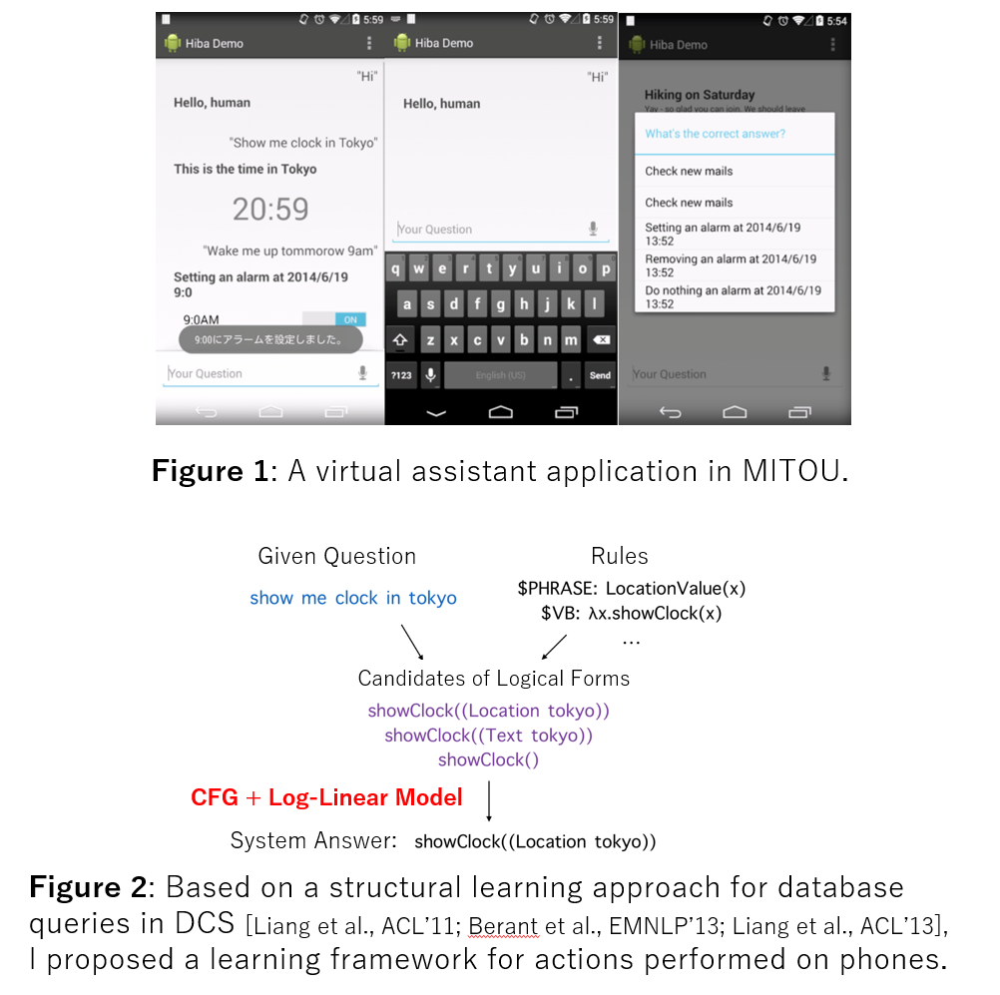

# Hiroyoshi Komatsu’s Resume
* Email: <hiroyoshi.komat@gmail.com>
* Born: 1997/03/29
* Links: [Slideshare](<https://www.slideshare.net/torotoki>), [GitHub](https://github.com/torotoki), [Bitbucket](https://bitbucket.org/torotoki/), [LinkedIn](https://www.linkedin.com/in/hiroyoshi-komatsu-831b04213/), [Blog (Japanese)](<https://torotoki.hatenablog.com/>)

# Current Role
### Engineer, Preferred Networks (2023-04 to current)

# Education
### The University of Tokyo, Department of Computer Science, Master of Science (2021-04 to 2023-03)
### Keio University, Department of Information and Computer Science, Bachelor’s Degree (2018-04 to 2021-03)
### Keio University, Faculty of Environment and Information Studies (2016-09 to 2018-03)
### Passed Certificate for Students Achieving the Proficiency Level of Upper Secondary School Graduates Exam in Japan (2013-09)
* Effective from April 2016 (18 years old)

# Skills
* Programming Languages (proficient): Python, C/C++, Scala.
* Programming Languages (barely readable): Java, Haskell, JavaScript.
* Other skills: CUDA, Android app developing, SQL/NoSQL.
* Understanding of LLMs, natural language processing, deep learning and machine learning models.
* Understanding and basic research experience of mathematical logic (proof theory), computational complexity theory, and theoretical cryptography.
* Basic skills: Linux, git, kubernetes
<!-- 経験を書く -->

# Experience
## National Institute of Advanced Industrial Science and Technology (AIST) (September 2018 to 04 and 2018-07 to 2018-09)
* A research assistant. I’ve worked on designing and making a dataset for contextual semantic parsing task based on real search queries and making a deep learning system with PyTorch.

## MITOU project 2013 (2013-10 to 2014-07)
* Proposed the project "Developing a Practical Question Answering System", selected for Japan's MITOU Program (Exploratory IT Human Resources Project).
* Project overview:
  
* Project details: [https://www.ipa.go.jp/archive/jinzai/mitou/it/2013/index.html](https://www.ipa.go.jp/archive/jinzai/mitou/it/2013/index.html)
* I’ve proposed a new semantic parsing approach for virtual assistant applications. I implemented everything from a machine learning algorithm (log-linear model) and a natural language processing system, to a server-side backend and an Android application as the frontend.
* It has been awarded a selected “Super Creator” award of MITOU project 2013. (Less than 8% for all applicants, the youngest winner in time from 2000)

## National Institute of Informatics (NII) (2013-01 to 2014-07)
* Supervisor: Yusuke Miyao
* A technical assistant. 1) I’ve worked on making a semantic parsing system for database query generations from Japanese question sentences; 2) I’ve made a coreference resolution system as a part of a group project for a textual entailment workshop, NTCIR-10 RITE. (Our system achieves the top score on 1 out of 3 datasets among 12 teams)

## Nara Institute of Science and Technology (NAIST) (2011-07)
* Supervisor: Mamoru Komachi
* A Technical Assistant. I’ve made a converter for a predicate-argument structures corpus in the Japanese language with Python.

# Open-Source Projects
## simple-paged-attention
* Website: [https://github.com/torotoki/simple-paged-attention](https://github.com/torotoki/simple-paged-attention)
* A full-scratch implementation of PagedAttention in CUDA/C++.

## reasoning-minimal
* Website: [https://github.com/torotoki/reasoning-minimal](https://github.com/torotoki/reasoning-minimal)
* Minimal code to train a reasoning model from the base model with Group-Policy Reward Optimization (GRPO).

## corenlp-python
* Website: [https://bitbucket.org/torotoki/corenlp-python/](https://bitbucket.org/torotoki/corenlp-python/)
* A Python wrapper for Stanford CoreNLP, a set of essential libraries for natural language processing. This is a fork of Dustin Smith’s stanford-corenlp-python with new features and bugfixes.
* Received new **21** forks, **29** watchers in Bitbucket; also used by natural language processing engineers/researchers, also used in a source code for an international conference paper.

## BCCWJ-PAS
* Tools & dataset for predicate-argument structures and coreferences for Balanced Corpus of Contemporary Written Japanese (BCCWJ), a popular corpus for Japanese language.
* This is the project when I worked at Nara Institute of Science and Technology (NAIST) with Assistant Prof. Mamoru Komachi.
* Currently available as a part of [BCCWJ-DepParaPAS](https://github.com/masayu-a/BCCWJ-DepParaPAS).

## cuda-utils
* Website: [https://github.com/torotoki/cuda-utils](https://github.com/torotoki/cuda-utils)
* A collection of popular parallel algorithms written in CUDA, and a tiny utilities library.

# Other Works
* DG Lab Tokyo, 2016: I’ve made a contextual question answering system for experiment with PyTorch.
* Gakushuin University, 2016: I’ve made a benchmark system for a classification task of legal texts with PyTorch as a freelance.
* The University of Tokyo, 2023: Teaching Assistant of the lecture "Computational Complexity Theory".

# Misc
* NII Today No. 60, 2013: The Younger Generation Discusses Their Hopes for the Todai
Robot Project.
  * Japanese: [https://www.nii.ac.jp/userdata/results/pr_data/NII_Today/60/p10-11.pdf](https://www.nii.ac.jp/userdata/results/pr_data/NII_Today/60/p10-11.pdf),
  * English: [https://www.nii.ac.jp/userdata/results/pr_data/NII_Today/60/p10-11.pdf](https://21robot.org/introduce/Thats-Collaboration-2-e.html)
* Languages:
  * Japanese: native
  * English: TOEFL iBT 86 (2020-07), TOEIC 920 (2024-10)

# Publications
* PLaMo-100B: A Ground-Up Language Model Designed for Japanese Proficiency, 2024. Preferred Elements et al. arXiv preprint arXiv:2410.07563. [https://arxiv.org/abs/2410.07563](https://arxiv.org/abs/2410.07563)
* The Logic for a Mildly Context-Sensitive Fragment of the Lambek-Grishin Calculus, 2021. Hiroyoshi Komatsu. arXiv preprint arXiv:2101.03634. [https://arxiv.org/abs/2101.03634](https://arxiv.org/abs/2101.03634)
* The Display Calculus and Proof Nets for the Lambek-Grishin Calculus, and Mildly Context-Sensitive Grammars, 2021. Hiroyoshi Komatsu. SLACS.
* Latent Dirichlet Allocation for Wikipedia (Japanese), 2013. Hiroyoshi Komatsu, YANS.
* BnO at NTCIR-10 RITE: A Strong Shallow Approach and an Inference-based Textual
Entailment Recognition System, 2013. Ran Tian, Yusuke Miyao, Takuya Matsuzaki, Hiroyoshi Komatsu. NTCIR-10.

# Other Presentations
<iframe src="//www.slideshare.net/slideshow/embed_code/key/cDfhiCGzk5wShW" width="340" height="290" frameborder="0" marginwidth="0" marginheight="0" scrolling="no" style="border:1px solid #CCC; border-width:1px; margin-bottom:5px; max-width: 100%;" allowfullscreen> </iframe> 
 <strong> <a href="//www.slideshare.net/torotoki/dsirnlp04" title="Scala による自然言語処理" target="_blank">Scala による自然言語処理</a> </strong> von <strong><a href="https://www.slideshare.net/torotoki" target="_blank">Hiroyoshi Komatsu</a></strong> 

<iframe src="//www.slideshare.net/slideshow/embed_code/key/FyzPaHKnXKZxmb" width="340" height="290" frameborder="0" marginwidth="0" marginheight="0" scrolling="no" style="border:1px solid #CCC; border-width:1px; margin-bottom:5px; max-width: 100%;" allowfullscreen> </iframe> 
 <strong> <a href="//www.slideshare.net/torotoki/ss-14069592" title="質問応答システム入門" target="_blank">質問応答システム入門</a> </strong> from <strong><a href="https://www.slideshare.net/torotoki" target="_blank">Hiroyoshi Komatsu</a></strong> 

<iframe src="//www.slideshare.net/slideshow/embed_code/key/4niSnCHCwrJrsk" width="340" height="290" frameborder="0" marginwidth="0" marginheight="0" scrolling="no" style="border:1px solid #CCC; border-width:1px; margin-bottom:5px; max-width: 100%;" allowfullscreen> </iframe> 
 <strong> <a href="//www.slideshare.net/torotoki/ss-9720666" title="鬱くしい日本語のための形態素解析入門" target="_blank">鬱くしい日本語のための形態素解析入門</a> </strong> from <strong><a href="https://www.slideshare.net/torotoki" target="_blank">Hiroyoshi Komatsu</a></strong> 

<iframe src="//www.slideshare.net/slideshow/embed_code/key/4jtzfoax1UfbPQ" width="340" height="290" frameborder="0" marginwidth="0" marginheight="0" scrolling="no" style="border:1px solid #CCC; border-width:1px; margin-bottom:5px; max-width: 100%;" allowfullscreen> </iframe> 
 <strong> <a href="//www.slideshare.net/torotoki/torotoki" title="スペル修正プログラムの作り方 #pronama" target="_blank">スペル修正プログラムの作り方 #pronama</a> </strong> from <strong><a href="https://www.slideshare.net/torotoki" target="_blank">Hiroyoshi Komatsu</a></strong> 

